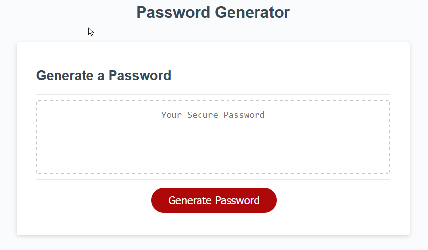

# Challenge - JavaScript Password Generator

## Description

This application will generate a password for the user when they click the "Generate Password" button. The user is prompted to enter a password length between 10 & 64 characters. Once the user has selected the number of characters, they are asked if they want their password to contain  uppercase, lowercase, numeric or special characters.

Once the user has selected their options, the application will update on-screen the newly generated password.

**Note:** The user must select a password length between 10 & 64 characters and **at least** one character type.

## Live demo

[View deployed application on Github Pages](https://gurdeep-ninja.github.io/Password-Generator/)

## Screenshot

## Installation & usage

Clone or download this project as a zip file & extract to your websites root directory.

Simply open the `index.html` file in your browser and press the **'Generate Password'** button.

The application works in any web browser with JavaScript enabled - including mobile/tablet responsive devices.
## Technologies
    